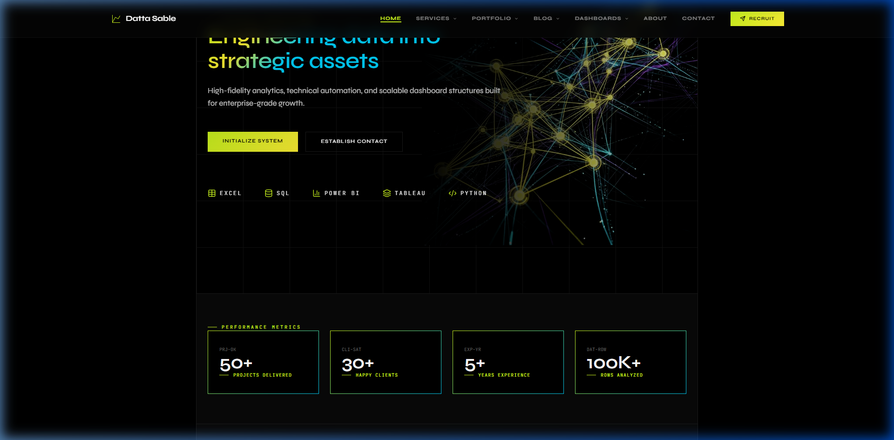
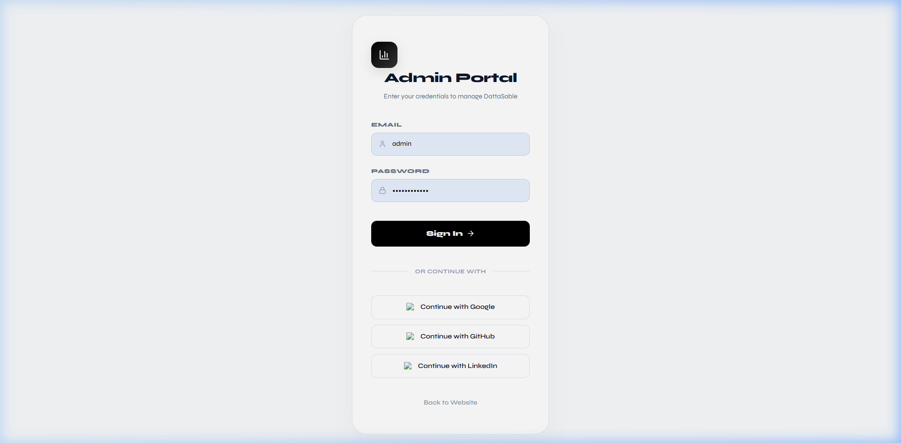
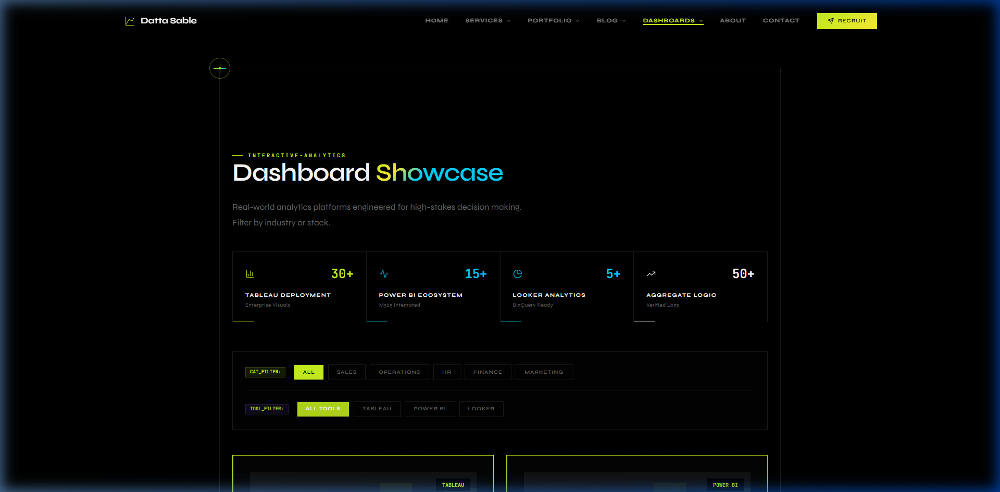

<p align="center">
  
</p>

<h1 align="center">Surgical AI Workspace</h1>

<p align="center">
  <strong>Engineering Data & Logic into Strategic Assets.</strong><br>
  A high-performance, full-stack Business Intelligence, Automation, and Web Solutions ecosystem.
</p>

<p align="center">
  <a href="https://github.com/sabledattatray/dattasable/stargazers"></a>
  <a href="https://github.com/sabledattatray/dattasable/network/members"></a>
  <a href="https://dattasable.com"></a>
  <a href="https://github.com/sabledattatray/dattasable/blob/main/LICENSE"></a>
</p>

<br />

---

## 📊 Technical Performance & Stats

<p align="center">
  
  
</p>

<p align="center">
  
</p>

---

## 💎 The Ecosystem

This platform is a **Surgical Enterprise Architecture**. It bridges the gap between deep data engineering, autonomous automation, and executive-tier digital storytelling.

### 🚀 Core Pillars
- **⚡ Elite Performance**: Sub-second load times via Next.js 15, React 19 Server Components, and Edge Optimization.
- **🛡️ Surgical BI**: Real-time intelligence dashboards featuring 10M+ row processing and autonomous data auditing.
- **⚙️ n8n Automation**: Complex multi-agent workflow orchestration for scaling technical authority.
- **📚 Knowledge Hub**: A high-authority semantic mesh of Technical RFCs, Frameworks, and Case Studies.
- **📱 Native Interop**: Fully integrated with the [ds-droid](https://github.com/sabledattatray/ds-droid) native mobile client.

---

## 📸 Technical Showcase

### 🪐 The Surgical Experience (Hero)
The landing page establishes immediate authority with high-fidelity technical visualization and surgical logic design.



### 📊 Intelligence Command Center
Clean, enterprise-grade interfaces designed for high-stakes decision making and real-time telemetry.

| **Admin Infrastructure** | **Analytics Telemetry** |
| :--- | :--- |
|  |  |

---

## 🛠️ The Surgical Stack

<table width="100%">
  <tr>
    <td width="33%" valign="top">
      <h4>Frontend & UX</h4>
      <ul>
        <li>Next.js 15 (App Router)</li>
        <li>React 19 Server Components</li>
        <li>Tailwind CSS 4.0</li>
        <li>Framer Motion (Micro-interactions)</li>
      </ul>
    </td>
    <td width="33%" valign="top">
      <h4>Backend & Data</h4>
      <ul>
        <li>PostgreSQL (Prisma ORM)</li>
        <li>DuckDB (Analytical Engine)</li>
        <li>Node.js (Technical Runtime)</li>
        <li>NextAuth (Secure OAuth)</li>
      </ul>
    </td>
    <td width="33%" valign="top">
      <h4>Engineering & BI</h4>
      <ul>
        <li>Python (Automation)</li>
        <li>Power BI / Tableau (Advanced)</li>
        <li>SQL (Surgical Optimization)</li>
        <li>n8n (Workflow Orchestration)</li>
      </ul>
    </td>
  </tr>
</table>

---

## 📈 Search & Performance Authority

| Metric | Score | Signal |
| :--- | :--- | :--- |
| **Performance** | **98+** | 🚀 Zero Blocking Time |
| **Accessibility** | **100** | ♿ Universal Fidelity |
| **Best Practices** | **100** | 🏆 Enterprise Grade |
| **SEO Authority** | **100** | 🔍 Crawl-Optimized |

---

## 🛠️ Infrastructure Setup

```bash
# Clone the infrastructure
git clone https://github.com/sabledattatray/dattasable.git

# Install technical dependencies
npm install

# Initialize local environment
cp .env.example .env

# Provision Database & Seed
npx prisma db push
npx prisma db seed

# Launch Surgical Workspace
npm run dev
```

---

## 🤝 Establish Contact

Currently accepting high-impact **BI Consulting** and **Workflow Architecture** engagements.

- **Technical Portfolio**: [dattasable.com](https://dattasable.com)
- **LinkedIn Authority**: [/in/dattasable](https://linkedin.com/in/dattasable)
- **Direct Intel**: [info@dattasable.com](mailto:info@dattasable.com)

<p align="center">
  <br />
  
  <br />
  <br />
  © 2026 Datta Sable. Built for the 2026 Distribution Economy.
</p>
