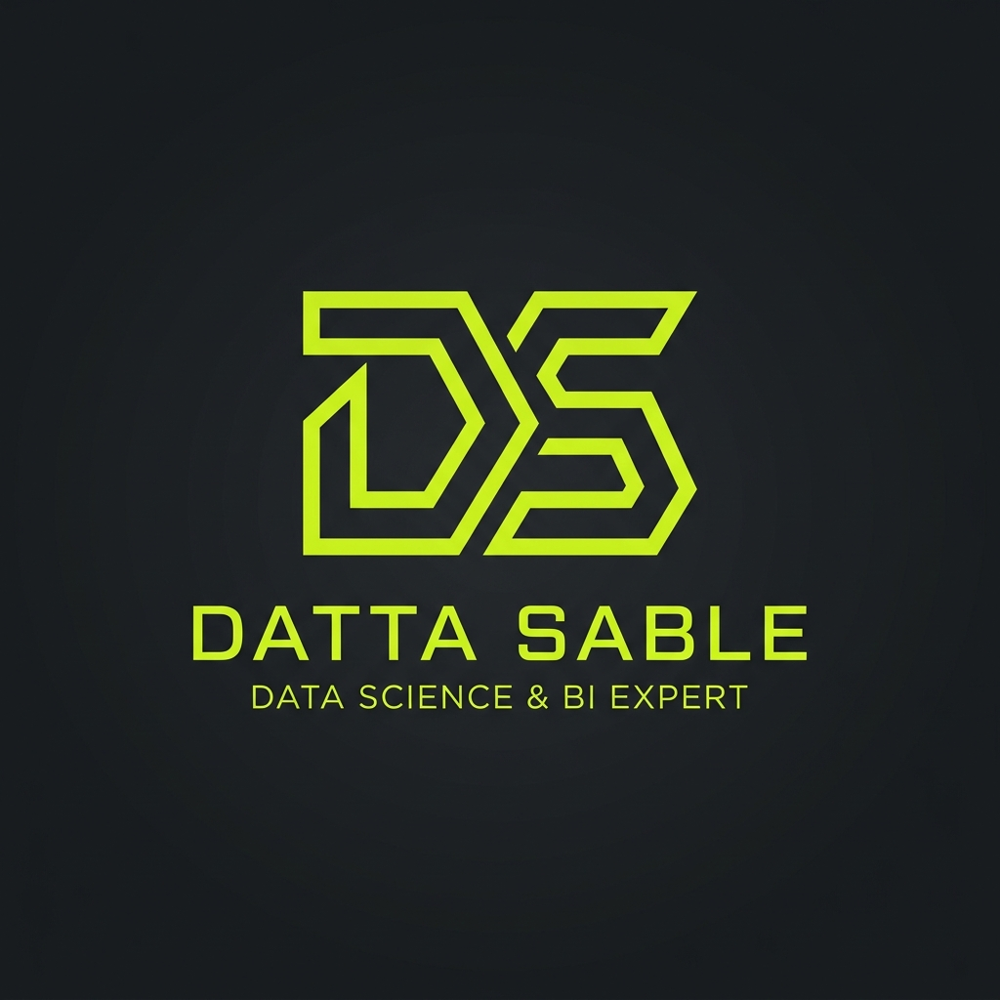

# Surgical AI Workspace

### Engineering Data & Logic into Strategic Assets.
A high-performance, full-stack Business Intelligence, Automation, and Web Solutions ecosystem.

---

## Technical Performance & Stats

---

## Ecosystem & Pillars
- **Elite Performance**: Next.js 15 & React 19 Server Components.
- - **Surgical BI**: Real-time intelligence dashboards featuring 10M+ row processing.
  - - **Automation**: n8n workflow orchestration.
   
    - ---

    ## Showcase
    

    ---

    ## Contact
    - **Portfolio**: [dattasable.com](https://dattasable.com)
    - - **LinkedIn**: [in/dattasable](https://linkedin.com/in/dattasable)
     
      - ---
      Designed with Surgical Logic
      2026 Datta Sable.
      
