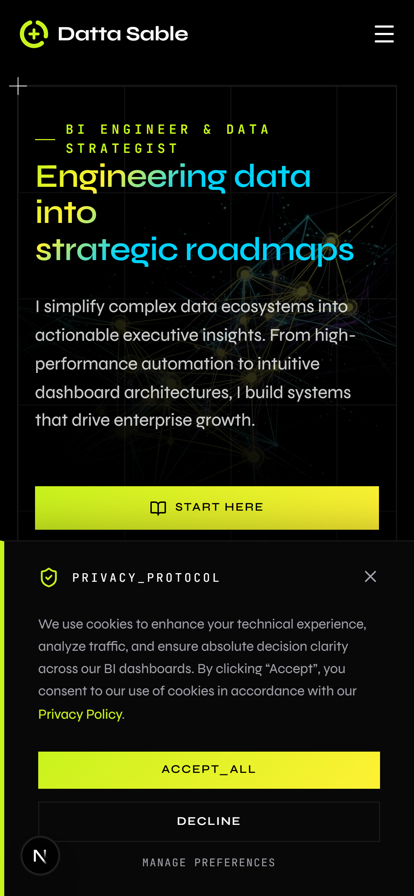
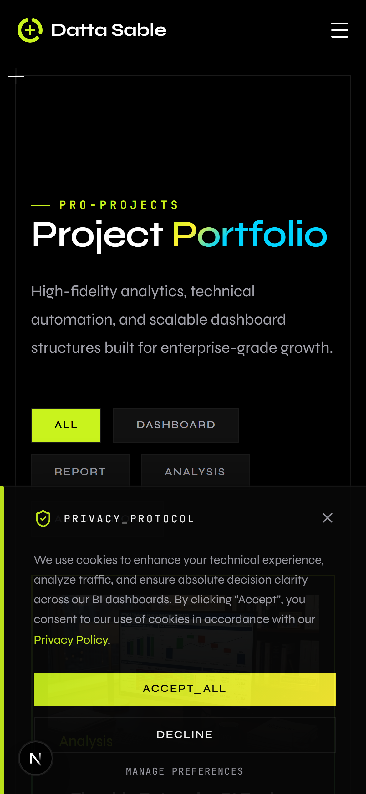
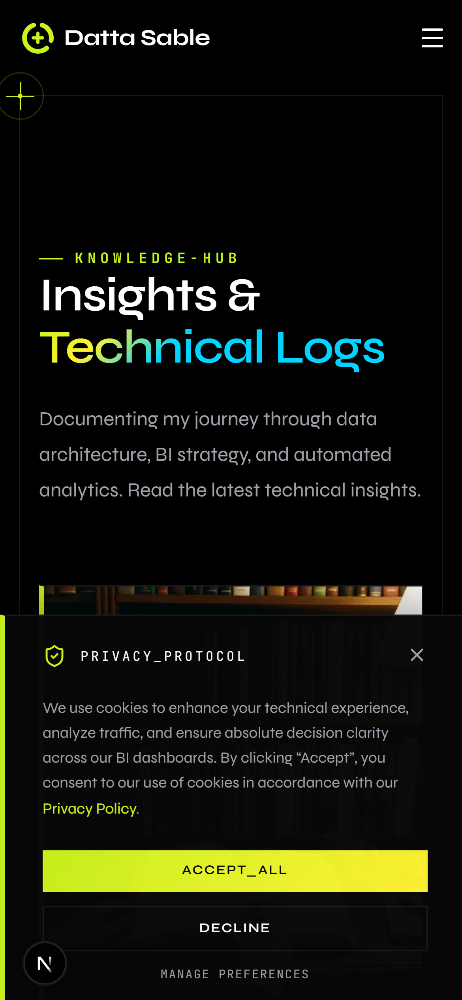
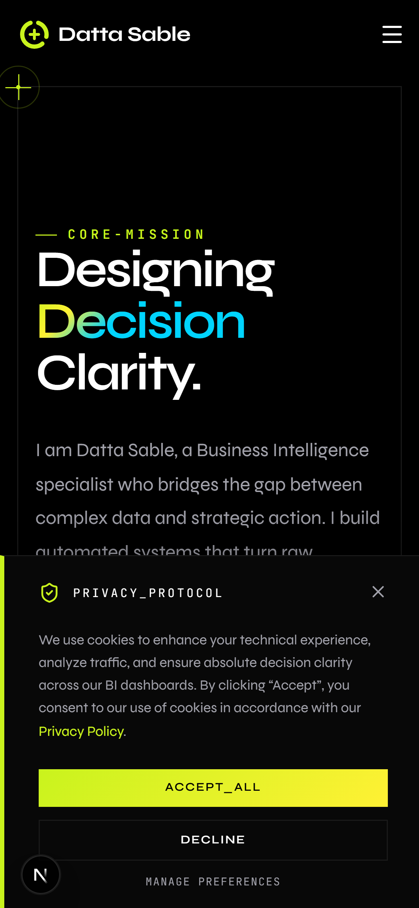

<div align="center">
  <h1>📱 Datta Sable | ds-droid</h1>
  <p><strong>The Official Mobile Client for the Datta Sable Enterprise Ecosystem</strong></p>

  [](https://capacitorjs.com/)
  [](https://developer.android.com/)
  [](https://nextjs.org/)
  [](LICENSE)
</div>

---

## 💎 Project Overview

**`ds-droid`** is the high-performance native Android application for the Datta Sable Business Intelligence and Automation platform. Built using **Capacitor**, this repository serves as the dedicated mobile wrapper for our Next.js web application, delivering sub-second edge-cached performance natively to mobile devices.

By isolating the Android client into its own repository, we ensure robust cross-platform stability, prevent web-to-mobile code contamination, and streamline Google Play Store deployments.

---

## 📸 Mobile Experience Showcase

The mobile interface brings the entire enterprise web platform into the palm of your hand, featuring dynamic grids, glassmorphism UI elements, and highly responsive touch interactions.

<table align="center">
  <tr>
    <td align="center"><b>Enterprise Hub (Home)</b></td>
    <td align="center"><b>Analytics Portfolio</b></td>
  </tr>
  <tr>
    <td></td>
    <td></td>
  </tr>
  <tr>
    <td align="center"><b>Knowledge Engine (Blog)</b></td>
    <td align="center"><b>Executive Profile (About)</b></td>
  </tr>
  <tr>
    <td></td>
    <td></td>
  </tr>
</table>

---

## 🚀 Key Features

- **Native Hardware Access**: Unrestricted access to device-level APIs via Capacitor plugins.
- **Unified Codebase Synchronization**: Automatically syncs production build artifacts (`out/`) from the core Next.js engine.
- **Elite Performance**: Optimized WebP asset delivery and localized hardware-accelerated transitions.
- **Restricted Enterprise Access**: Secure OAuth authentication flow optimized for mobile web views.
- **Fluid Layout Architecture**: 100% responsive Tailwind UI tailored for iOS and Android safe areas.

---

## 🛠️ Build & Installation

To run the `ds-droid` client locally, you will need **Android Studio** and **Java Development Kit (JDK)** installed.

### 1. Initial Setup
```bash
# Clone the Android repository
git clone https://github.com/sabledattatray/ds-droid.git

# Navigate into the project
cd ds-droid
```

### 2. Synchronization
If you have updated the core web repository, you must synchronize the Android assets:
```bash
# In your MAIN web repository (dattasable)
npm run build
npx cap sync android
```
*(The synchronized `/android` folder will then act as the source of truth for this repo).*

### 3. Launching in Android Studio
```bash
# Open the project in Android Studio
npx cap open android
```
Once Android Studio opens, allow Gradle to sync. You can then run the app on a physical device via USB debugging or use the Android Emulator.

---

## 🔒 Security & Privacy

This application interacts with proprietary APIs and restricted enterprise dashboards. All authentication tokens are handled securely via edge infrastructure. 

---

<p align="center">
  Built with 📱 and ☕ by <b>Datta Sable</b><br>
  © 2026 Datta Sable. All Rights Reserved.
</p>
